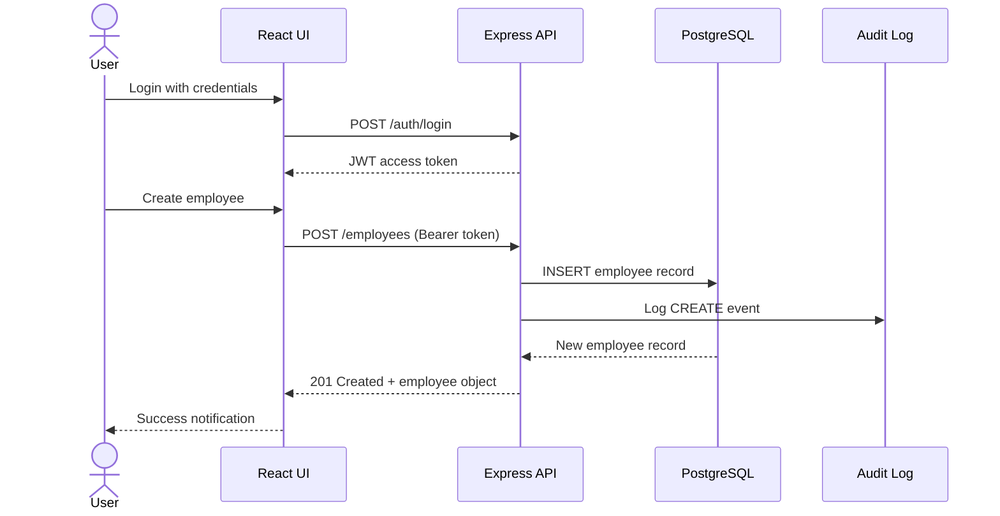
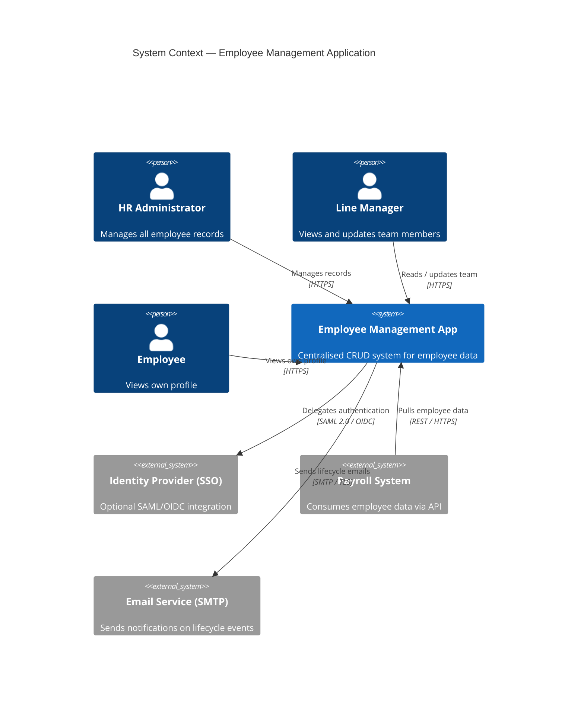
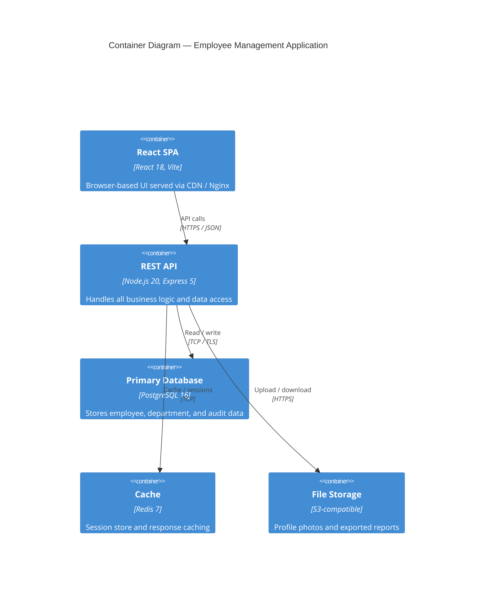
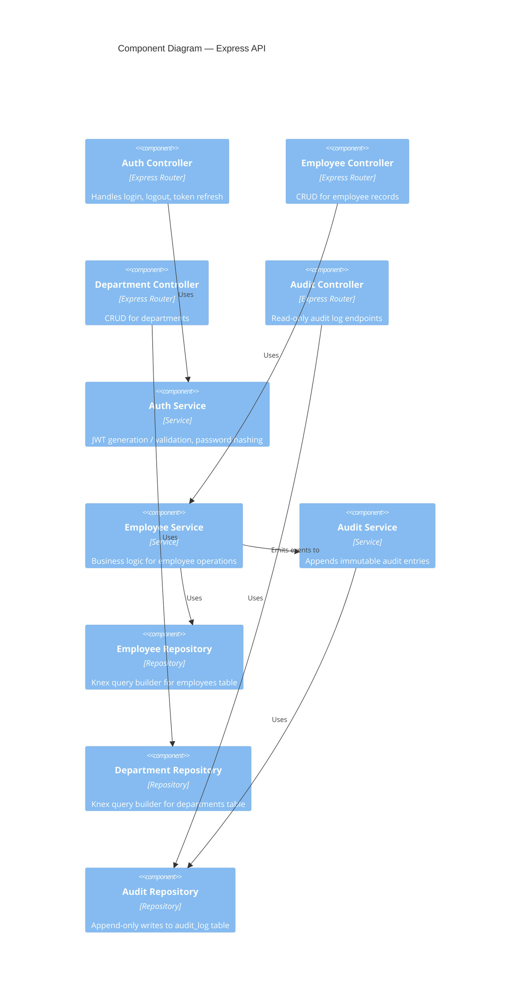
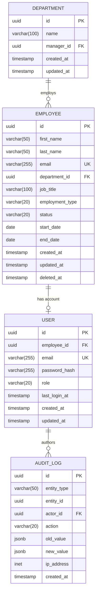
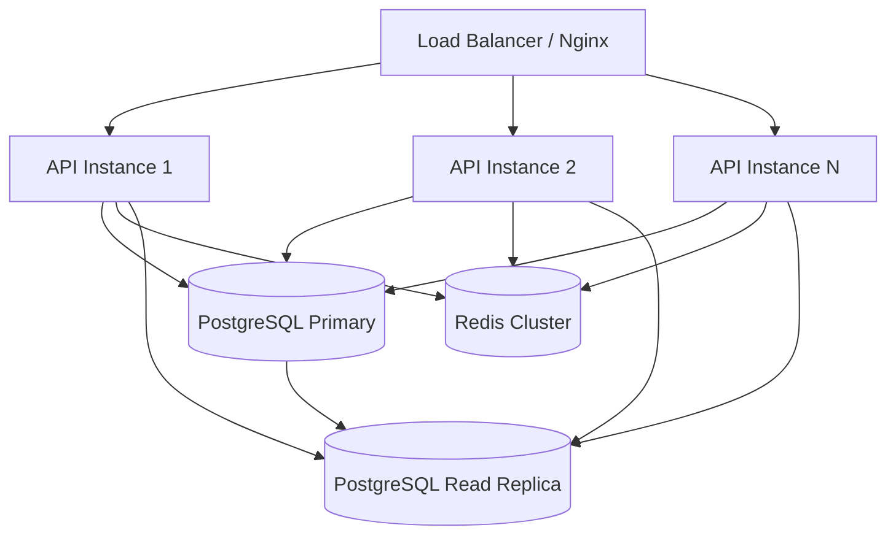
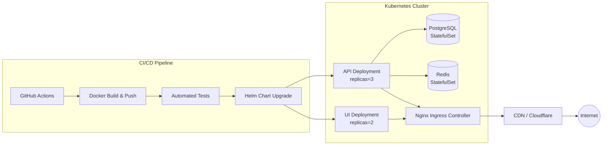

# Technical Design Document: Employee Management Application

## Table of Contents

1. [Problem Statement](#1-problem-statement)
2. [Proposed Solution](#2-proposed-solution)
3. [System Architecture](#3-system-architecture)
4. [Component Breakdown](#4-component-breakdown)
5. [API Design](#5-api-design)
6. [Data Models](#6-data-models)
7. [Security Considerations](#7-security-considerations)
8. [Performance Requirements](#8-performance-requirements)
9. [Deployment Strategy](#9-deployment-strategy)
10. [Trade-offs and Alternatives](#10-trade-offs-and-alternatives)
11. [Success Metrics](#11-success-metrics)

---

## 1. Problem Statement

Enterprise organisations need a reliable, centralised system to manage employee records, track departmental assignments, and maintain workforce data. Manual processes using spreadsheets or disconnected tools lead to:

- **Data inconsistency** — duplicate or conflicting employee records across teams.
- **Poor auditability** — no reliable history of changes to personnel records.
- **Limited access control** — sensitive payroll and personal data exposed broadly.
- **Scalability bottlenecks** — manual workflows that do not scale with headcount growth.
- **Slow onboarding / offboarding** — no automated provisioning tied to HR state changes.

This application provides a single-source-of-truth for employee data with full CRUD operations, role-based access control, and an auditable change history.

---

## 2. Proposed Solution

Build a **RESTful web application** with a React front-end, a Node.js/Express API layer, and a PostgreSQL database. The system exposes:

- A **browser-based UI** for HR administrators and managers to create, view, update, and delete employee records.
- A **REST API** consumed by both the UI and potential third-party integrations (payroll, identity providers).
- **JWT-based authentication** with role-based authorisation (Admin, Manager, Employee).
- An **audit log** that records every mutation to employee data, including who made the change and when.

### High-Level Flow



---

## 3. System Architecture

### 3.1 Context Diagram



### 3.2 Container Diagram



### 3.3 Component Diagram — API Layer



---

## 4. Component Breakdown

### 4.1 Front-End (React SPA)

| Component | Responsibility |
|---|---|
| `AuthProvider` | Stores JWT in memory, attaches Bearer header to all API calls, handles token refresh. |
| `EmployeeList` | Paginated, sortable, filterable table of employees. |
| `EmployeeForm` | Controlled form for create / edit with client-side validation (Zod). |
| `EmployeeDetail` | Read-only profile view including audit timeline. |
| `DepartmentManager` | CRUD UI for department records (Admin only). |
| `AuditLogViewer` | Immutable timeline of changes to a given record. |
| `RoleGuard` | HOC / wrapper that hides or disables UI elements based on the current user's role. |

### 4.2 API Layer (Node.js / Express)

| Module | Responsibility |
|---|---|
| `router/auth` | `/auth/login`, `/auth/logout`, `/auth/refresh` |
| `router/employees` | `/employees` CRUD endpoints |
| `router/departments` | `/departments` CRUD endpoints |
| `router/audit` | `/audit` read-only query endpoints |
| `middleware/authenticate` | Validates JWT, populates `req.user` |
| `middleware/authorise` | Role-based guard, returns 403 on insufficient permissions |
| `middleware/validate` | Request schema validation using Zod |
| `middleware/rateLimiter` | Per-IP and per-user rate limiting via `express-rate-limit` + Redis |
| `service/employeeService` | Orchestrates business rules (e.g., dept validation on create) |
| `service/auditService` | Writes immutable audit entries on every mutation |

### 4.3 Database (PostgreSQL)

| Schema Object | Responsibility |
|---|---|
| `employees` | Core employee record table |
| `departments` | Department lookup table |
| `roles` | Enumerated roles (Admin, Manager, Employee) |
| `users` | Authentication credentials linked to employees |
| `audit_log` | Append-only record of all mutations |
| `sessions` (Redis) | Short-lived session / refresh-token storage |

---

## 5. API Design

### 5.1 Base URL

```
https://api.example.com/v1
```

### 5.2 Authentication

All endpoints except `/auth/login` require:

```
Authorization: Bearer <JWT>
```

### 5.3 Endpoint Reference

#### Authentication

| Method | Path | Description | Roles |
|---|---|---|---|
| `POST` | `/auth/login` | Exchange credentials for JWT | Public |
| `POST` | `/auth/logout` | Invalidate refresh token | Authenticated |
| `POST` | `/auth/refresh` | Obtain new access token | Authenticated |

#### Employees

| Method | Path | Description | Roles |
|---|---|---|---|
| `GET` | `/employees` | List employees (paginated, filterable) | Admin, Manager |
| `GET` | `/employees/:id` | Get single employee | Admin, Manager, Employee (own) |
| `POST` | `/employees` | Create employee | Admin |
| `PUT` | `/employees/:id` | Full update of employee | Admin |
| `PATCH` | `/employees/:id` | Partial update of employee | Admin, Manager |
| `DELETE` | `/employees/:id` | Soft-delete employee | Admin |

#### Departments

| Method | Path | Description | Roles |
|---|---|---|---|
| `GET` | `/departments` | List all departments | Admin, Manager |
| `GET` | `/departments/:id` | Get department + members | Admin, Manager |
| `POST` | `/departments` | Create department | Admin |
| `PUT` | `/departments/:id` | Update department | Admin |
| `DELETE` | `/departments/:id` | Delete department | Admin |

#### Audit Log

| Method | Path | Description | Roles |
|---|---|---|---|
| `GET` | `/audit` | Query audit entries (filterable by entity, actor, date range) | Admin |
| `GET` | `/audit/:entityType/:entityId` | Audit history for a specific record | Admin, Manager |

### 5.4 Request / Response Examples

**Create Employee — Request**

```json
POST /v1/employees
Content-Type: application/json
Authorization: Bearer <token>

{
  "firstName": "Jane",
  "lastName": "Doe",
  "email": "jane.doe@example.com",
  "departmentId": "dept_01",
  "jobTitle": "Software Engineer",
  "startDate": "2024-01-15",
  "employmentType": "FULL_TIME"
}
```

**Create Employee — Response**

```json
HTTP/1.1 201 Created
Content-Type: application/json

{
  "id": "emp_abc123",
  "firstName": "Jane",
  "lastName": "Doe",
  "email": "jane.doe@example.com",
  "departmentId": "dept_01",
  "jobTitle": "Software Engineer",
  "startDate": "2024-01-15",
  "employmentType": "FULL_TIME",
  "status": "ACTIVE",
  "createdAt": "2024-01-15T09:00:00Z",
  "updatedAt": "2024-01-15T09:00:00Z"
}
```

**Error Response**

```json
HTTP/1.1 422 Unprocessable Entity
Content-Type: application/json

{
  "error": "VALIDATION_ERROR",
  "message": "Request validation failed",
  "details": [
    { "field": "email", "message": "Must be a valid email address" }
  ]
}
```

---

## 6. Data Models

### 6.1 Entity Relationship Diagram



### 6.2 Key Field Definitions

#### `employees.employment_type`
`FULL_TIME | PART_TIME | CONTRACT | INTERN`

#### `employees.status`
`ACTIVE | ON_LEAVE | TERMINATED`

#### `users.role`
`ADMIN | MANAGER | EMPLOYEE`

#### `audit_log.action`
`CREATE | UPDATE | DELETE | RESTORE`

---

## 7. Security Considerations

### 7.1 Authentication & Authorisation

- **JWT Access Tokens**: Short-lived (15 minutes), signed with RS256 (asymmetric key pair). Private key stored in a secrets manager (e.g., AWS Secrets Manager).
- **Refresh Tokens**: Long-lived (7 days), stored as `httpOnly`, `Secure`, `SameSite=Strict` cookies in Redis. Rotated on every use (refresh token rotation).
- **Role-Based Access Control (RBAC)**: Enforced at the API middleware layer. The React UI also hides non-authorised features, but server-side enforcement is the source of truth.
- **SSO Integration** (optional): Support for SAML 2.0 / OIDC for enterprise identity providers, disabling local password authentication when active.

### 7.2 Data Protection

- **Passwords**: Hashed with `bcrypt` (cost factor ≥ 12). Never stored or logged in plaintext.
- **Sensitive PII**: Fields such as national ID, salary, and bank account numbers are encrypted at rest using AES-256 (column-level encryption in PostgreSQL via `pgcrypto`).
- **Transport Security**: TLS 1.2+ enforced on all endpoints. HTTP Strict Transport Security (HSTS) header set.
- **Database Credentials**: Injected via environment variables or a secrets manager. Never hard-coded.

### 7.3 Input Validation & Injection Prevention

- All incoming request bodies and query parameters are validated against Zod schemas before reaching business logic.
- Database queries use parameterised statements (Knex query builder). Raw SQL avoided.
- File uploads (profile photos) are validated for MIME type and size, stored in object storage (not the file system), and served through pre-signed URLs with short TTL.

### 7.4 Rate Limiting & Abuse Prevention

- Login endpoint: 10 requests / 15 min per IP using `express-rate-limit` backed by Redis.
- All authenticated endpoints: 1 000 requests / minute per user.
- Responses include `Retry-After` header when limit is exceeded.

### 7.5 Security Headers

Applied globally via `helmet`:

```
Content-Security-Policy: default-src 'self'
X-Frame-Options: DENY
X-Content-Type-Options: nosniff
Referrer-Policy: strict-origin-when-cross-origin
Permissions-Policy: camera=(), microphone=()
```

### 7.6 Audit Logging

Every write operation (CREATE / UPDATE / DELETE) records:
- The acting user ID and IP address.
- Before and after snapshots of the changed fields (PII fields redacted in logs).
- Timestamp in UTC.

Audit log rows are **append-only** (no UPDATE / DELETE permissions granted to the application role on `audit_log`).

---

## 8. Performance Requirements

### 8.1 Response Time Targets (P95)

| Endpoint Category | Target |
|---|---|
| `GET /employees` (list, ≤ 100 rows) | < 200 ms |
| `GET /employees/:id` | < 100 ms |
| `POST / PUT / PATCH /employees` | < 300 ms |
| `GET /audit` | < 500 ms |
| Login (`/auth/login`) | < 400 ms |

### 8.2 Throughput

- Support **500 concurrent users** without degradation.
- API layer designed to be **horizontally scalable** (stateless; session state in Redis).

### 8.3 Scalability Strategy



- **Read replicas**: List and detail GET requests routed to read replicas via connection pool (PgBouncer).
- **Response caching**: Department list and role lookups cached in Redis (TTL: 5 min, invalidated on write).
- **Database indexing**: Composite index on `(department_id, status)` for common filter queries; index on `email` for login lookup.
- **Pagination**: All list endpoints require `limit` (max 100) and `cursor`-based pagination to avoid expensive `OFFSET` scans on large tables.

### 8.4 Availability Target

- **99.9% uptime** (≤ 8.7 hours downtime per year).
- Rolling deployments via Kubernetes ensure zero-downtime updates.
- PostgreSQL with streaming replication; automatic failover via Patroni.

---

## 9. Deployment Strategy

### 9.1 Infrastructure Overview



### 9.2 Environments

| Environment | Purpose | Deployment Trigger |
|---|---|---|
| `development` | Local developer machines | Manual (`docker compose up`) |
| `staging` | Integration testing, QA review | Push to `main` branch |
| `production` | Live system | Tagged release (`v*.*.*`) |

### 9.3 Containerisation

Each service ships as a **multi-stage Docker image**:

```
Stage 1 — Builder: Install deps, compile TypeScript, run unit tests
Stage 2 — Runtime: Copy compiled output, run as non-root user (UID 1001)
```

Images are scanned for CVEs in CI using `trivy` before pushing to the registry.

### 9.4 Database Migrations

- Migrations managed by **Knex** (`knex migrate:latest`).
- Executed as a **Kubernetes init container** before the API pods start.
- Migrations are forward-only; destructive changes require a two-phase deploy (add column → backfill → drop old column).

### 9.5 Configuration Management

- Environment-specific config injected via **Kubernetes Secrets** (backed by a secrets manager).
- No secrets in container images or Git history.
- Feature flags managed via environment variables.

### 9.6 Rollback Strategy

- Kubernetes deployment history retained for 5 revisions.
- `kubectl rollout undo deployment/api` triggers instant rollback.
- Database migration rollback requires a manual reviewed script (not automated).

---

## 10. Trade-offs and Alternatives

### 10.1 REST vs GraphQL

| | REST | GraphQL |
|---|---|---|
| **Chosen** | ✅ | ❌ |
| **Reason** | Simpler to implement, cache, and secure. HR tools are CRUD-heavy; flexible querying benefits are marginal. GraphQL can be added later if reporting needs grow. |

### 10.2 PostgreSQL vs MongoDB

| | PostgreSQL | MongoDB |
|---|---|---|
| **Chosen** | ✅ | ❌ |
| **Reason** | Employee data is highly relational (employees ↔ departments ↔ users). Strong ACID guarantees required for payroll-adjacent data. Schema enforcement prevents data drift. |

### 10.3 JWT in Memory vs HttpOnly Cookie

| | JWT in Memory | HttpOnly Cookie |
|---|---|---|
| **Chosen** | Access token in memory ✅ | Refresh token in cookie ✅ |
| **Reason** | Access tokens in memory are not vulnerable to XSS-based theft. Refresh tokens in `httpOnly` cookies are not accessible to JavaScript. Combining both gives defence-in-depth. |

### 10.4 React SPA vs Server-Side Rendering (SSR)

| | React SPA | SSR (Next.js) |
|---|---|---|
| **Chosen** | ✅ | ❌ |
| **Reason** | Internal HR tool; SEO is not a concern. SPA simplifies deployment (static assets on CDN). SSR can be adopted if the app is ever made public-facing. |

### 10.5 Monolith vs Microservices

| | Monolith | Microservices |
|---|---|---|
| **Chosen** | ✅ (modular monolith) | ❌ |
| **Reason** | Team size and initial scale do not justify microservice complexity. The modular architecture (separate controllers, services, repositories) makes future extraction straightforward if needed. |

---

## 11. Success Metrics

### 11.1 Functional

- 100% of employee CRUD operations available through the UI and API.
- Role-based access correctly enforced: Employees cannot view others' records; Managers cannot delete records; Admins have full access.
- Audit log captures every mutation with actor identity and timestamp.

### 11.2 Performance

- P95 API response time within targets defined in Section 8.1 under load (500 concurrent users).
- Zero timeout errors (HTTP 504) under normal operating load.
- Database query P95 < 50 ms for indexed queries.

### 11.3 Reliability

- 99.9% uptime measured over any rolling 30-day window.
- Zero data loss: all writes confirmed by PostgreSQL primary before 200/201 response returned.
- Automated failover completes within 30 seconds of primary DB failure.

### 11.4 Security

- Zero high/critical CVEs in container images (enforced by CI gate).
- All authentication bypass attempts return 401 within 50 ms.
- Penetration test completed before first production release; all Critical/High findings resolved.

### 11.5 Developer Experience

- New developer environment bootstrapped in < 10 minutes via `docker compose up`.
- CI pipeline (lint → test → build → deploy to staging) completes in < 10 minutes.
- Code coverage ≥ 80% for API service layer.
